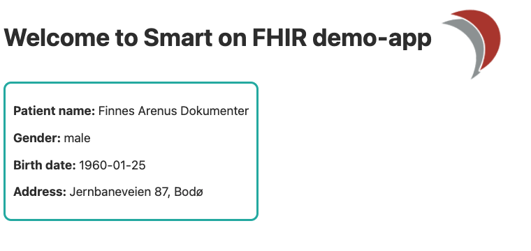

# DIPS SMART on FHIR demo app

SMART on FHIR app that fetches a patient and lists some of its information. The
app fetches data from any SMART on FHIR enabled FHIR server, such as our FHIR
server in the [Open DIPS](https://open.dips.no) sandbox.



# Run

Before you run the app you'll need to fill inn the necessary config in the
[.env](.env) file. This includes API keys to Open DIPS, as well as client id and
secret for the OpenID Connect server.

```
npm run dev
```
